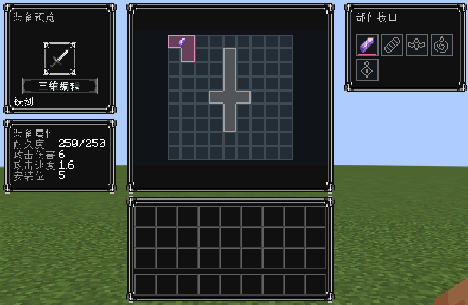

# Equipment Structure API

Equipment Structure API is a NeoForge 1.21.1 API for equipment that carries modular parts. It provides host templates, single-interface installation, component compatibility, custom grid space, server-authoritative transactions, attributes, behavior callbacks, data-driven appearance, and a client assembly screen.

This repository is the first publishable baseline. It does not promise to read development snapshots or migrate old experimental saves. Release `0.1.0` is the starting data format for new content mods.

中文接入说明：[0.1.1 接入起步](docs/接入起步.md)。本模组提供 API 和预设模板，演示装备与部件由内容模组注册；不会自动改造全部原版装备。



The screenshot uses an isolated test component to show its custom footprint. Test content is excluded from the release JAR.

## Requirements

- Minecraft 1.21.1
- NeoForge 21.1.244 or later compatible 21.1 release
- Java 21

## Core model

- A host template defines an equipment type and its concrete installation points.
- Every installation point has one stable `slotId` and holds zero or one component.
- A component declares its own component type, supported equipment types, and `GridFootprint`.
- A host template owns the `GridBoard`: the visible area, the equipment body shape, and whether the body occupies cells.
- The slot checks interface and component compatibility. The component footprint checks spatial occupancy.
- `required`, `optional`, `capacity`, and automatic "complete assembly" checks are not part of this API.

## Publish a host template

Create a data-driven template at:

```text
src/main/resources/data/<namespace>/equipment_structure_api/host_definition/<path>.json
```

Example:

```json
{
  "id": "examplemod:steel_sword",
  "equipment_type": "equipment_structure_api:sword",
  "version": 1,
  "slots": [
    {
      "id": "examplemod:blade",
      "interface_type": "examplemod:blade",
      "component_type": "examplemod:blade"
    }
  ],
  "grid": {
    "area": [{"x": 0, "y": 0}, {"x": 1, "y": 0}],
    "body": [{"x": 0, "y": 0}],
    "body_placement": {"x": 0, "y": 0, "rotation": 0},
    "body_occupies_cells": true
  }
}
```

The template is loaded into the `HOST_DEFINITION` data registry. Java `EquipmentHostDefinition.builder(...)` constructs an object for tests or runtime composition; it is not a second template registry.

## Bind an item

Bind an item to an existing template with one of the public host provider mechanisms:

```java
EquipmentHostProviders.register(item,
        ResourceLocation.fromNamespaceAndPath("examplemod", "steel_sword"));
```

Or use the `equipment_structure_api:host_binding` data map. The binding selects the template; it does not define the template.

Initialize the item on the server:

```java
EquipmentStructureApi.initializeFromProvider(stack, server.registryAccess());
```

## Define a component

```java
EquipmentComponentDefinition blade = EquipmentComponentDefinition.builder(
        ResourceLocation.fromNamespaceAndPath("examplemod", "steel_blade"),
        ResourceLocation.fromNamespaceAndPath("examplemod", "blade"),
        ResourceLocation.fromNamespaceAndPath("examplemod", "blade"))
    .suitableFor(BuiltinEquipmentTypes.SWORD)
    .footprint(GridFootprint.fixed(GridShape.mask("##", ".#")))
    .build();

EquipmentComponentRegistry.register(blade);
```

The component item or an `EquipmentComponentItemAdapter` supplies the runtime instance. Install, replace, and remove through `EquipmentStructureApi` or the assembly menu so the server remains authoritative.

## Build

```text
gradlew.bat clean build
```

The normal build packages the API only. Development GameTests are opt-in and are not included in the release JAR:

```text
gradlew.bat test
gradlew.bat -PincludeGameTests=true runGameTestServer
```

The output is `build/libs/equipment_structure_api-0.1.1.jar` and its sources JAR.

## License

MIT. See [LICENSE](LICENSE).
