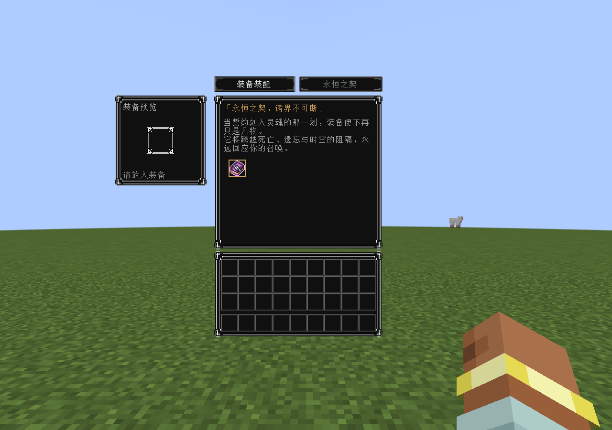
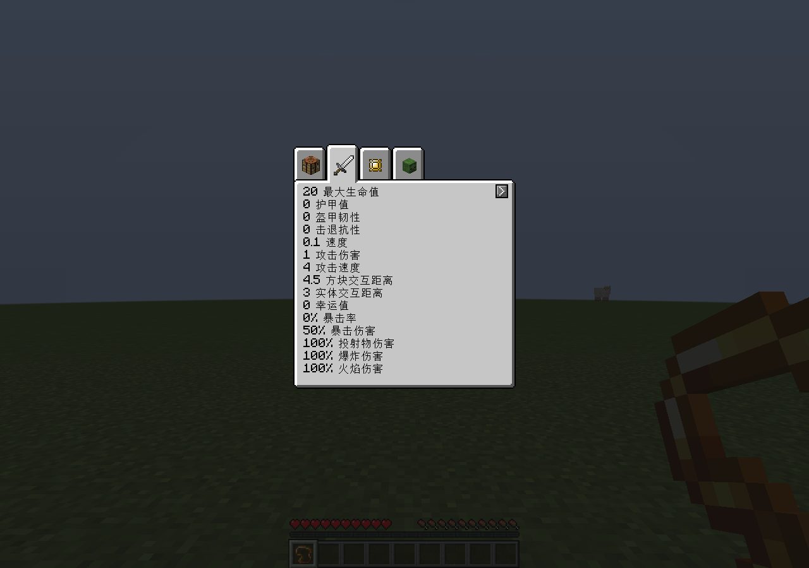
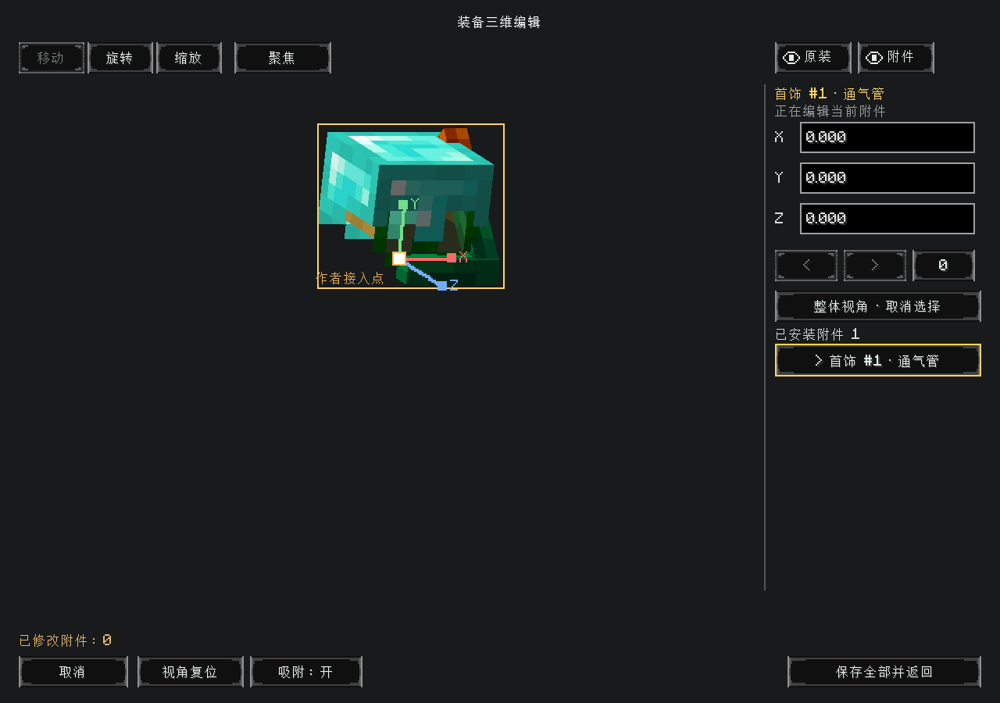

# 0.2.0-alpha.3 validation

Final release checks: normal clean build, all 325 JUnit tests (zero failures/errors/skips), all 194 required Curios GameTests and all 166 required standalone GameTests pass. The additional Curios case rejects new bindings in conditionally persistent addon-granted capacity while preserving that native capacity. Earlier alpha.3 real-client regressions also pass the Enigmatic display/world-render scenario and standalone assembly without Curios. These checks complement, rather than replace, the original-addon scenarios below.

## Celestial, Hostility and Pandora acceptance

The isolated client and dedicated server use Minecraft 1.21.1 / NeoForge 21.1.249, Curios 9.5.1+1.21.1, Celestial Artifacts 2.0.4, Celestial Core 2.0.2, L2Hostility 3.0.18, CurseOfPandora 3.0.7, L2Library 3.0.8, L2Complements 3.1.3 and Patchouli 93. The loader selects the bundled L2Core 3.0.8+18, L2Tabs 3.0.5+7 and Pandora API 1.0.5. No addon JAR or source is repackaged.

The final run produces `CELESTIAL_CATALOG_PASSED`, `CELESTIAL_SERVER_LOGIC_PASSED` and explicit `CELESTIAL_SMOKE_PASSED` on both server and client:

- 124 routable original items pass 134 item/type checks, comparing the equipment adapter against the original native validator and round-tripping full item components. This covers usable visible native types; Pandora's private inner-only charms remain under its container rules. It is not an exhaustive gameplay test of every item's effect.
- Celestial's original startup listener first encounters an equip-event veto: no item or `cs` flag is created. Removing the veto lets the same listener successfully bind the scroll without armor. Its survival removal lock, configuration-authorized release, real empty-hand UI reinstallation, `ALWAYS_KEEP`, actual lethal damage and client-driven respawn preserve a single player-owned scroll.
- All managed type/index pairs route to one corresponding armor category. The real Precious Bracelet grants a ring. A real Curse of Spell inside a Pandora necklace grants two helmet slots using its fixture-only `head#2` configuration. Removing that inner item ends its token, shrinks head capacity and returns the displaced Detector Glasses exactly once. Conditional persistent modifiers do not unlock binding slots.
- Original Celestial attributes, L2 curse queries and tick-updated item components, Pandora inner-item `isEquipped` and health attributes work through equipment. Direct native inner-container mutation survives armor copy. Removing/re-equipping chest armor removes/restores its native effects while leaving the scroll bound.
- Original L2 sealing transforms a stored ring. Its real restoration pocket clears the sealed item, waits its own timer, then restores it to armor. An absent-armor recovery returns one original ring to inventory, with no duplicate when armor is worn again.
- Real durability destruction recovers the Pandora necklace and leaves the scroll bound. The fixture counts the recovered necklace relative to the addon's separate legitimate startup gift.
- Client/server menu packets install the scroll and edit the original Pandora container. L2's original accessory menu omits managed entries while capability visibility stays intact. Actual L2 attribute and difficulty screens render successfully. Screenshots were visually inspected for the covenant, nested container, attributes and difficulty.

Sources: [CelestialArtifacts 2.0.4](https://github.com/Minecraft-Celestial/CelestialArtifacts/tree/bdba50f5e27d809287f2f10a0eaa7423504b6fb8), [L2Hostility 3.0.18](https://github.com/Minecraft-LightLand/L2Hostility/tree/f53a018a590785de7eccf2e1a5836976424331f2), [CurseOfPandora 3.0.7](https://github.com/Minecraft-LightLand/CurseOfPandora/tree/807a189d7d8fa74bea605c9d0e931e431fd6d73f). The Hostility commit also publishes matching Pandora/L2Tabs sources in `libs/`; these were checked against the runtime JARs.

Reproduce both smoke processes with `-PincludeClientTest=true -PcelestialSmoke=true -Pneo_version=21.1.249 -PcompatTestMods=<original-addon-jars> -PcompatTestLibraries=<selected-bundled-compile-jars>`. Compile-only libraries include the runtime-selected L2Core, L2DamageTracker, L2MenuStacker, L2Tabs, L2Serial, Pandora and Registrate versions; do not add these a second time to the runtime mod directory. Server/client directories are `run-celestial-server` / `run-celestial-client`, port 25586, with a disposable fresh world and the ordinary smoke-server settings. This fixture resets its player. It does not touch a real modpack world.

This scenario does not separately validate all combat/progression effects, full process-restart persistence for these particular addons, or a single simultaneous pack containing these addons plus Enigmatic Legacy+ and Artifacts. The respective original-addon suites are separate. Pandora's native container can be opened from hand/inventory; opening it directly from an installed component has no dedicated assembly-screen action yet.

## Artifacts acceptance and display fixes

The final Artifacts client/server run uses Minecraft 1.21.1, NeoForge 21.1.249, Curios 9.5.1+1.21.1, Artifacts 13.2.5, Architectury 13.0.11 and Cloth Config 15.0.140 (including Artifacts' bundled ExpandAbility 12.0.0). An earlier run also passed on NeoForge 21.1.244 before the final preview/tab fixes. The unmodified local addon JARs are not redistributed. Source was inspected at [Artifacts 13.2.5](https://github.com/ochotonida/artifacts/tree/7cf7dc42e322e13f096eea16cee17a4b400b75f7).

- All 45 wearable items pass the five-type native validation matrix and lossless data-component round trips. Actual `head`, `necklace`, `hands` (two), `belt` and `feet` slots come from the addon's data, with no synthetic slot overrides.
- Six original items coexist on all four armor categories. Original Curios queries and the Artifacts equipment provider find them. The fixture checks configured Power Glove/Cross Necklace/Crystal Heart attributes, removal/re-equip, native shrinking-toggle mutation through armor copy, double-jump and Warp Drive ability discovery, and Aqua Dashers' sprint-dependent fluid-collision hook.
- Hands expand from two to five on the chest template only. Removing the grant recovers the occupied extra index exactly once. Ordinary items/transient indices do not enter Eternal Covenant.
- Real lethal damage triggers the original Chorus Totem rescue and consumes its stored item once. Real chestplate durability destruction returns its accessories once and removes the Power Glove modifier.
- Direct Artifacts auto-equip into an empty managed player slot reports failure and retains the source item. The original zombie auto-equip path still succeeds.
- All 55 item/index combinations (both hand indices for gloves) emit actual native geometry in the editor and native world layer. Checks compare adult neutral-model alignment, three-axis translation in the preview, world translation, per-component visibility and native render flags. Preview tests deliberately corrupt the shared renderer age/pose and verify that the isolated preview stays correct without changing that shared model. Native Power Glove first-person geometry is checked on both hands.
- For every wearable, attribute detail rows include the text produced by the addon's original tooltip helper. Client/server packets perform UI insertion, save X=2 from the real 3D screen, equip the returned helmet and synchronize the native client inventory. The initial equipment tab is checked after container synchronization. Screenshots confirm actual grid UI and aligned helmet/accessory models.

Explicit `ARTIFACTS_CATALOG_PASSED`, `ARTIFACTS_SERVER_PHASE_PASSED`, `ARTIFACTS_RENDER_PASSED` and both `ARTIFACTS_SMOKE_PASSED` markers are required. A Gradle success line alone does not establish acceptance.

Run both smoke processes with `-PincludeClientTest=true -PartifactsSmoke=true -Pneo_version=21.1.249 -PcompatTestMods=<directory-containing-the-four-local-jars>`, following the isolated-server instructions below. These tests reset the test player. All wearable slots/models are checked; this is not a playthrough of all 45 effects. Warp Drive pearl packets, double-jump input packets, full Artifacts death/respawn, long-running multiplayer, and first-person custom pose/hide are not covered by this scenario. The first-person glove renderer still uses its original channel; editor transforms and our component hide flag apply to the standard third-person path.

## Display and ownership fixes

Alpha.2 reruns: 325 JUnit tests with zero failures/errors/skips; all 193 required GameTests with Curios; all 166 without Curios. Separate client/server runs pass the real-addon display scenario, the registered native Curios renderer/visibility scenario, and standalone installation/removal and item-transfer checks without Curios.

The alpha.2 real-addon `-PdisplaySmoke=true` scenario uses the original Hell Blade Charm, Enigmatic Amulet, Majestic Elytra, an ordinary Iron Ring and a player-bound Seven Curses ring. Server/client `DISPLAY_PASSED` markers verify localized component details without encoded type IDs, native attack/negative armor modifier text, all three accessory geometries in the editor, a saved charm offset, and an Eternal Covenant panel that excludes the worn ordinary ring. Screenshots are inspected for wrapping, scrolling, actual item appearance and binding ownership.

`CURIOS_DISPLAY_WORLD_PASSED` runs the actual mixed-in native world layer on an isolated, unticked wearer. It checks fallback geometry, the same model-unit position offset as the editor, saved visibility, native render off/on and no fallback without an equipment owner. Native renderers and registered external-layer adapters retain precedence over item models.

The added GameTest covers a binding beside an ordinary armor item, a permanent capacity grant, a transient grant appearing on the correct template after its normal per-tick refresh, and a freed stable index becoming eligible for binding. The Curios matrix now contains 193 required tests.

The following sections record the original alpha.1 acceptance baseline; alpha.2 rerun results are listed with the release artifacts.

## Original compatibility baseline

Minecraft 1.21.1, Java 21, Windows. Core and synthetic Curios tests use NeoForge 21.1.244; original Enigmatic Legacy+ tests use 21.1.249.

## Automated regression matrix

- With Curios 9.5.1+1.21.1: all 192 required GameTests passed.
- Without Curios: all 166 required GameTests passed.
- A normal clean release build passes all 325 JUnit tests with zero failures, errors or skips. A separate no-Curios client/server run confirms grid installation/removal, equipment transfer and item counts without optional-class loading failures.
- The added coverage includes shared player-binding capacity, multiple simultaneous bindings, refusal to bind in transient slots, stale/replayed panel requests, five slots on one template, native overflow returning exactly one item, and refreshing grid metadata after transfer/removal.
- Existing coverage includes custom types/footprints, native validation, ownership through save/copy/rebuild/death, cosmetic overflow, query invalidation and durability-break recovery. Unit coverage includes sidebar layouts from 1 through 256 slots.
- Slot-contract tests exercise public validator queries and equip-event vetoes, native visibility metadata, inactive queries/reactivation, exact functional callback/attribute counts versus cosmetic slots, binding UI `onEquipFromUse`, ordinary and bound-item transformations, explicit native backup/restore with absent armor, private hidden slot opt-out, and slot-extension creative cloning with survival rejection.
- Real synthetic client/server acceptance verifies that only the old menu's managed entries are hidden while native metadata stays unchanged. Native rendering toggles synchronize off/on and actually stop/resume the original renderer; the editor retains the original renderer and saved pose.

## Original addon acceptance

Tests load these unmodified local JARs; none is redistributed:

- Curios 9.5.1+1.21.1
- Enigmatic Legacy+ 1.21.1-1.1.1
- Patchouli 1.21.1-93-NEOFORGE
- Caelus 7.0.1+1.21.1

An actual development client connects to an isolated dedicated server. Explicit server and client PASS markers confirm assertions; successful process exit alone is insufficient.

- Phase 1: UI installation of seven original accessories; original armor/luck/Caelus modifiers; effect removal and restoration; native scroll/spellstone advancement unlocks; original wing-layer preview and server-saved 3D offset.
- Phase 2: actual process restart restores seven accessories; real durability destruction returns each exactly once; Seven Curses ownership survives armor swap, break, naked state, death and respawn.
- Binding acceptance (`PHASE4_PASSED`): the integrated empty-hand assembly UI installs Seven Curses and a second declared binding; ordinary capacity remains shared. The second binding uses the original iron ring with a fixture-only policy, simulating another author opting in. This does not make the iron ring a permanent binding in the release.
- The same run exercises the addon's real `autoEquip` inventory Tick and `ultraHardcore` starter listener without armor, native curse-time progression, survival removal veto, and original Seven Curses/Redemption mutual exclusion.
- Dynamic acceptance uses the real Ascension Amulet and Enchanter Pearl. A fixture-only configuration routes all `charm` slots to the helmet. A chest amulet grants a helmet slot; the helmet pearl adds another. Counts progress 1 → 2 → 3 → 2 → 1 → 2 → 1 across installation, remote-source removal, unequip, re-equip and break. Overflow returns once; the source item and bindings retain the correct owner. The release defaults still route `charm` to the chest unless configured otherwise.
- A subsequent true server/client restart (`PHASE3_PASSED`) restores the naked bound player and original curse time, then removes the ring through the personal panel under the original creative-mode permission, returning exactly one original item.
- Survival unbinding (`PHASE5_PASSED`) uses the addon's real Bless Stone death conversion into Redemption and its Nether lava-pool ritual with Cursed Stone. It checks single player ownership of the replacement without armor, its original removal lock, stopped curse time, native ejection of incompatible cursed accessories, destruction of the binding, and the synchronized empty panel. EnigmaticEye consumes the ritual marker during respawn, so the fixture verifies it before that native dialogue handler. The hardcore direct-use Bless Stone path was source-inspected but not separately exercised.
- Screenshots were inspected for two visible player bindings without equipment, the bound ring after death, and the addon's original elytra model in the 3D editor.
- The final binding/dynamic scenario and true-restart scenario were repeated after the slot-contract fixes. Final Chinese UI checks show the “永恒之契” tab, “「永恒之契，诸界不可断」” panel title, full author-supplied text and non-overlapping slot geometry.

## Reproduction and packaging

Run core tests with `-PincludeGameTests=true runGameTestServer`; add `-PwithoutCurios=true` for the independent API. The ordinary client fixture uses `-PincludeClientTest=true -PwithoutCurios=true`; the synthetic renderer fixture uses `-PincludeClientTest=true -PcuriosSmoke=true`.

For the original-addon fixture add `-PincludeClientTest=true -PenigmaticSmoke=true -Pneo_version=21.1.249 -PcompatTestMods=<local-jar-directory>`. Run phase 1 without a resume flag, then restart both processes with `-PenigmaticResume=true` for phase 2. For the expanded binding/dynamic scenario start both with `-PbindingSmoke=true`; subsequently restart both with that flag plus `-PboundResume=true` to verify saved bindings and release them. Use `-PunbindSmoke=true` for survival conversion/destruction. These scenarios reset their test player and are independent of phases 1/2.

The fixtures expect disposable `run-smoke-server` and `run-smoke-client` directories, a loopback server on `127.0.0.1:25586`, and development authentication settings. Follow Minecraft's server EULA. Start `runSmokeServer`, wait for `Done`, then start `runSmokeClient` with identical properties. Fixtures reset the test player's inventory, may kill/respawn it, and stop the server after logout. Never run them on a real world. Some native addon missing-model warnings also occur with these original development JARs; assertion results and verified screenshots establish the tested behavior.

Use a normal `clean build` without fixture flags or local addon JARs for distribution. Fixture-enabled builds reject JAR packaging. The normal artifact must contain only API code/resources, the license and 0.2.0-alpha.3 metadata; inspect both binary and sources JARs for accidental test or third-party contents.

## Limits

This is an alpha compatibility release, not a claim to cover every addon or long-running multiplayer workload. Special render layers require adapters. Player bindings have no equipment grid or equipment 3D editing. Temporary capacity cannot accept new permanent bindings. Assemblies do not pretend that unworn equipment is active, and native cyclic capacity dependencies are not replaced by a second solver. External grave mods, arbitrary forced insertion, slot-type removal and other custom lifecycle overrides need separate integration tests. Development-save migration is outside the supported upgrade path.
